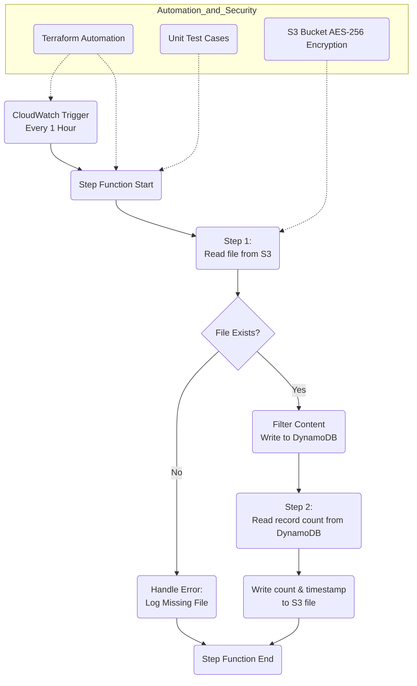

# Data-Drift
AWS Project

```mermaid
flowchart TD
    A(CloudWatch Trigger<br>Every 1 Hour) --> B(Step Function Start)
    B --> C(Step 1:<br>Read file from S3)
    C --> D{File Exists?}
    D -- Yes --> E(Filter Content<br>Write to DynamoDB)
    D -- No --> F(Handle Error:<br>Log Missing File)
    E --> G(Step 2:<br>Read record count from DynamoDB)
    G --> H(Write count & timestamp<br>to S3 file)
    F --> I(Step Function End)
    H --> I(Step Function End)

    subgraph Automation_and_Security
        J(Terraform Automation)
        K(S3 Bucket AES-256 Encryption)
        L(Unit Test Cases)
    end

    J -.-> A
    J -.-> B
    K -.-> C
    L -.-> B
```

